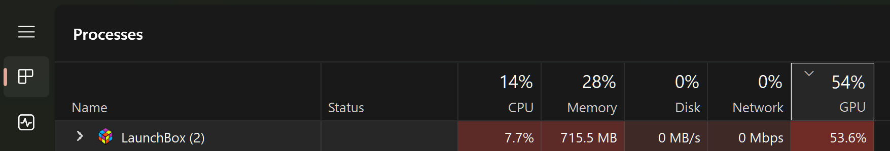
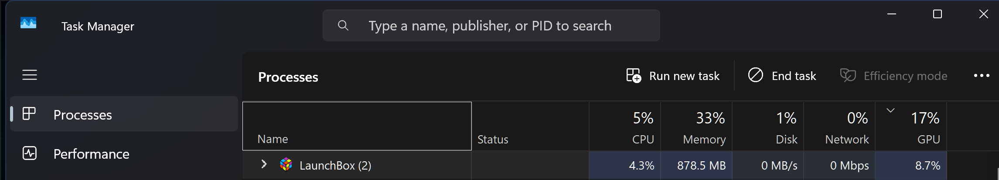

# LaunchBox Render Fix

A small LaunchBox/Big Box plugin that cuts idle GPU usage caused by WPF's UI rendering. It does
this without disabling hardware acceleration, so nothing in LaunchBox stops working.

## The problem

LaunchBox and Big Box are built on WPF (`net9.0-windows` as of LaunchBox 13.x). WPF hardware
accelerates its UI by default: every bit of box art, the platform wheel, hover highlights,
background art, and scroll animations gets composited through the GPU continuously, for as long
as the window is visible, whether or not anything is actually changing on screen.

On a normal sized library this is easy to miss. It became impossible to miss on a **~15,600 game
library** (36 platforms, ~16k ROMs): LaunchBox was sitting at **53.6% GPU utilization** just
idling in a game list, with video snaps/previews fully disabled and nothing playing. That's not a
leak or malware, it's WPF's compositor doing exactly what it's designed to do. A bigger library
means a bigger and more complex visual tree to keep composited every frame, so the baseline cost
is higher to begin with. Task Manager's Processes tab (GPU column) will show this as
`LaunchBox.exe`/`BigBox.exe` sitting well above 0% at idle.



This isn't a targeted performance problem, nothing feels slow. It's wasted GPU headroom and heat
for an app that's supposed to be a static list you glance at before launching a game. On a system
where the GPU is already under thermal pressure (small case, dusty heatsink, hot ambient
temperature) this can be enough sustained extra load to trip a thermal warning that has nothing to
do with LaunchBox itself, just extra heat that didn't need to be generated.

## Who this is actually useful for

If your library is small and LaunchBox's GPU usage already reads near 0% at idle, this plugin has
nothing to fix for you. It matters if:

- You have a large library (low thousands of games and up) and want the launcher to actually be
  as lightweight as it looks
- You want to leave LaunchBox open in the background (a second monitor, alt-tabbing back to it
  between games) without it contesting GPU resources with whatever else is running
- You're on a laptop or a system where extra sustained GPU load costs you fan noise, heat, or
  battery life for literally no benefit

## What this plugin actually does

It uses LaunchBox's official [Plugin SDK](https://pluginapi.launchbox-app.com/), specifically
`ISystemEventsPlugin.OnEventRaised`, which fires once the plugin is loaded (`PluginInitialized`)
and again once startup finishes (`LaunchBoxStartupCompleted` / `BigBoxStartupCompleted`). Plugins
run **in-process**, so this is two small, public WPF API calls made at the right moments in that
process's lifetime. Full source is in `src/RenderFixPlugin.cs`, it's about 60 lines.

1. **Cap the animation frame rate to 10fps**
   (`Timeline.DesiredFrameRateProperty.OverrideMetadata`)
   WPF ticks animations (hover glow, fades, scroll momentum) at roughly your monitor's refresh
   rate by default. There's no functional reason a launcher needs that: nothing about hovering
   over a box art tile needs to update 144 times a second. This has to run before any `Timeline`
   object has been created anywhere in the process, since overriding a type's default metadata is
   only allowed before that type has "locked in" its metadata. It's applied as early as possible
   (`PluginInitialized`) and wrapped in a try/catch in case something already beat it to it.

2. **Set cheaper image scaling on the main window**
   (`RenderOptions.SetBitmapScalingMode(mainWindow, BitmapScalingMode.LowQuality)`)
   Every box art thumbnail gets resized from its source resolution down to tile size, and that
   resizing uses a scaling shader. The default mode prioritizes quality; `LowQuality` is cheaper
   per frame. `BitmapScalingMode` is an inherited property, so setting it once on the root window
   (once `Application.Current.MainWindow` actually exists, at `LaunchBoxStartupCompleted` /
   `BigBoxStartupCompleted`) cascades to every descendant that doesn't explicitly set its own
   value, which in practice is everything. In testing, the visual difference was not noticeable.

That's the entire fix. Nothing inside LaunchBox itself is changed, nothing is written to disk
beyond LaunchBox's own `Plugins` folder, and removing it is just deleting the DLL.

### Why not just force software rendering?

The obvious-looking alternative is `RenderOptions.ProcessRenderMode = RenderMode.SoftwareOnly`,
which forces WPF to composite entirely on the CPU instead of the GPU. It works, GPU usage drops
to 0%, but it was tested and rejected: LaunchBox's Overview/game details panel (almost certainly
rendered through an embedded Chromium view via `CefSharp.OffScreen`, bridged into WPF with
`D3DImage`) went blank and stopped scrolling entirely. `D3DImage` requires a real hardware D3D
device to work at all, so it silently breaks under `SoftwareOnly`. That's not a screenshot
slideshow or some optional flourish, it's the panel that shows the game description, so this
approach was dropped. Confirmed by direct testing, not theoretical.

An earlier version of this repo (`LaunchBox-GPU2CPU-Fix`) shipped that approach. This version
replaces it entirely.

## Results

Tested on a ~15,600 game library, LaunchBox 13.27.0.0, RTX 4070 Ti Super, Windows 11:

| | GPU | CPU |
|---|---|---|
| Before | 53.6% | 7.7% |
| After | 8.7% (varies 3% to 18% run to run) | 4.3% |

Both numbers went down from baseline. This isn't a GPU-to-CPU trade, it's just cheaper
rendering. The GPU figure moves around some depending on what's visible in the list and
what else is running, but it stays well under baseline every time. The app also feels more
responsive navigating the game list, likely because there's less rendering work queued up
per input.



One minor quirk: loading some media (box art fade-ins, transitions) can take an extra half
second to a full second longer than before. Most likely explanation is the 10fps animation
cap itself: a fade or transition that used to tick at your monitor's refresh rate now ticks
at 10fps, so it takes a bit more wall-clock time to visually finish, even though nothing is
actually loading slower underneath.

## What this does NOT affect

- **Game/emulator performance.** Everything here is scoped to the single process that runs it
  (`LaunchBox.exe` / `BigBox.exe`). When you launch a game, that's a separate process (RetroArch,
  Dolphin, PCSX2, MAME, a standalone emulator, whatever) with its own independent GPU context.
  This plugin never touches it.
- Anything system-wide, any other application, any driver setting.
- Any in-app feature. The Overview panel, box art, screenshots, everything that worked before
  still works. That was the whole point of dropping the software-rendering approach.

## Installing

1. Build `src/LaunchBoxRenderFix.csproj` (see below), or grab `LaunchBoxRenderFix.dll` from
   [Releases](../../releases).
2. Copy the DLL into a new folder under your LaunchBox install, e.g.:
   `LaunchBox\Plugins\LaunchBoxRenderFix\LaunchBoxRenderFix.dll`
3. Restart LaunchBox / Big Box.

## Uninstalling

Delete the `LaunchBox\Plugins\LaunchBoxRenderFix` folder. That's the entire footprint.

## Building from source

Requires the [.NET 9 SDK](https://dotnet.microsoft.com/download/dotnet/9.0).

```
cd src
dotnet build -c Release
```

Before building, update the `HintPath` in `LaunchBoxRenderFix.csproj` to point at your own
`LaunchBox\Core\Unbroken.LaunchBox.Plugins.dll`. This repo doesn't redistribute Unbroken
Software's SDK assembly, your build has to reference the copy that ships with your own LaunchBox
install (it's marked `Private=false` so it isn't copied into your output, the plugin binds to the
copy already loaded by the host process at runtime).

## Tested against

- LaunchBox 13.27.0.0 (net9.0-windows / `Microsoft.WindowsDesktop.App` 9.0.16), regular desktop
  mode, not Big Box
- ~15,600 games across 36 platforms
- NVIDIA RTX 4070 Ti Super, Windows 11

**Big Box has not actually been tested.** The plugin handles `BigBoxStartupCompleted` the same
way as `LaunchBoxStartupCompleted`, and there's no reason it shouldn't work identically, but
nobody has watched it run in Big Box yet. Treat that as unverified until someone confirms it.

This is an early, experimental release. It's only been run on one library, one GPU, one LaunchBox
version. If you try it on a different setup, especially Big Box, a different library size, or a
different GPU vendor, opening an issue with what you saw (working or not) is genuinely useful.

Should work on any LaunchBox/Big Box build on the net9.0 codebase, since it only touches public
WPF APIs and one small, documented plugin interface. If it breaks on a different version, open an
issue.

## Why share this

This isn't a bug in LaunchBox that needs reporting, it's an architectural default (WPF's
GPU-compositor-always-on behavior, uncapped animation frame rate, full-quality image scaling
regardless of context) that the app never exposes a toggle for. If your library is big enough to
notice, this fixes it without waiting on an upstream setting that may never come.
